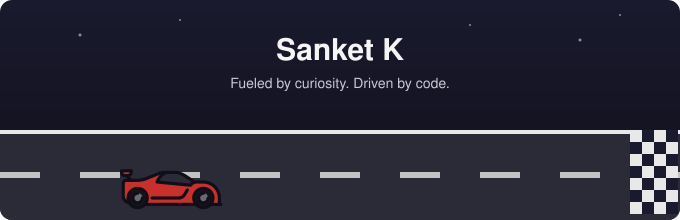

---

## 🏁 Starting Grid — About Me

- 🔭 **In the workshop:** building and fine-tuning new projects, treating every bug like a pit-stop fix
- 🌱 **Currently in driving school for:** React and MongoDB, going deeper every lap
- 💬 **Flag me down to talk about:** C, C++, Python, SQL, or Linux/Ubuntu
- ⚡ **Fun fact:** I enjoy debugging almost as much as I enjoy building — it's the chase before the finish line

---

## ⚙️ The Garage — Tech Stack

<table align="center">
<tr>
<td align="center" width="200"><b>🏎️ Engine (Languages)</b></td>
<td>

</td>
</tr>
<tr>
<td align="center"><b>🛞 Chassis (Web)</b></td>
<td>

</td>
</tr>
<tr>
<td align="center"><b>🔧 Fuel System (Data)</b></td>
<td>

</td>
</tr>
<tr>
<td align="center"><b>🏁 Pit Crew OS</b></td>
<td>

</td>
</tr>
</table>

---

## 📊 Lap Times — GitHub Stats

  
  

## 🎯 Track Record — Contribution Graph

  <picture>
    <source media="(prefers-color-scheme: dark)" srcset="./assets/snake-dark.svg" />
    
  </picture>

Generated automatically by a GitHub Action in this repo — updates daily, no third-party server involved.

## 🏆 Podium Finishes — Top Repos

  

---

🏁 Thanks for visiting the pit lane —

<!-- Proudly created with GPRM ( https://gprm.itsvg.in ) — racing banner custom-built -->